Hello fellow developer,

*Pluggy’s* mission is to allow users to own their financial data empowering them to not only have unlimited access to their information, but also to know who they share this information with and to revoke that access.

*MeuPluggy* is born with that premise, becoming a **free** consumer application that provides consent & data management so users can use their information as they need, and have full control of which third-party applications they share their access and to revoke that access if its not wanted.

Please join our discord server to discuss about the project, request features, report bugs and more: [https://discord.gg/M55jsC8S](https://discord.gg/M55jsC8S).

### Intro

This repository works as an open project that allows any MeuPluggy user the possibility to request a feature, report a bug or debate over the sharing of Open Finance data.

Pluggy’s development team is actively working on improving this application to provide a solution to finance, data & consent management, allowing developers to create tailor-made experiences around the Pluggy Data API and other no-code integrations.

### Connecting your bank account to MeuPluggy

First you will require to sign up at https://meu.pluggy.ai this will allow you to track all the consents made to third-parties and connect your bank accounts.

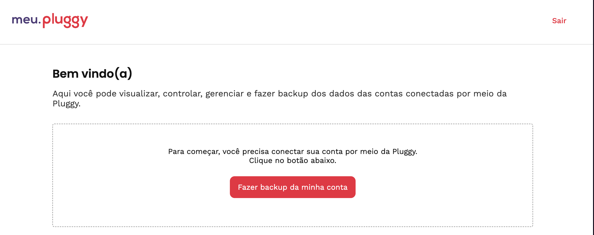

Press the main button to connect, find the institution you want to connect and connect through the authorization process. Most of the financial institution support the official Open Finance connectivity.

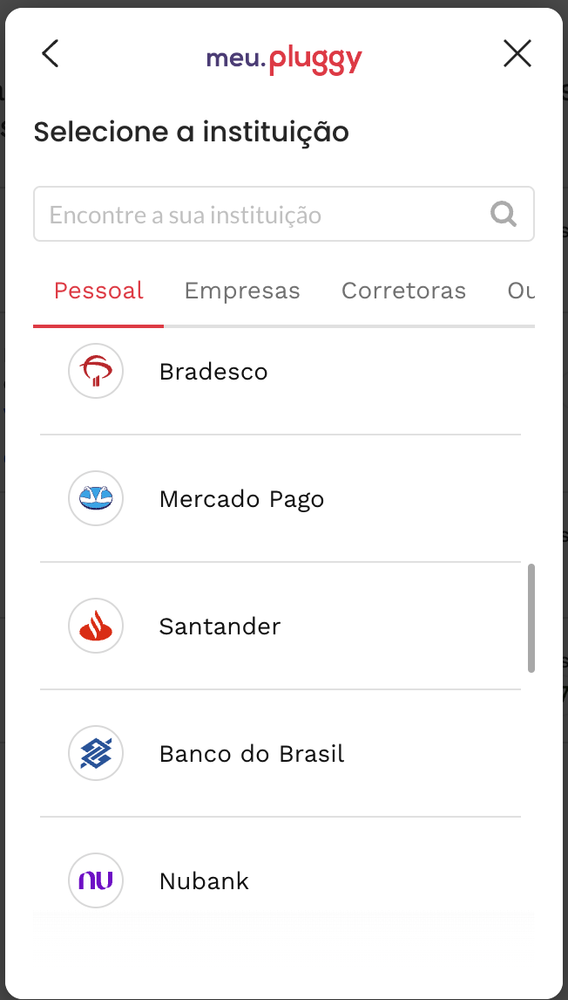 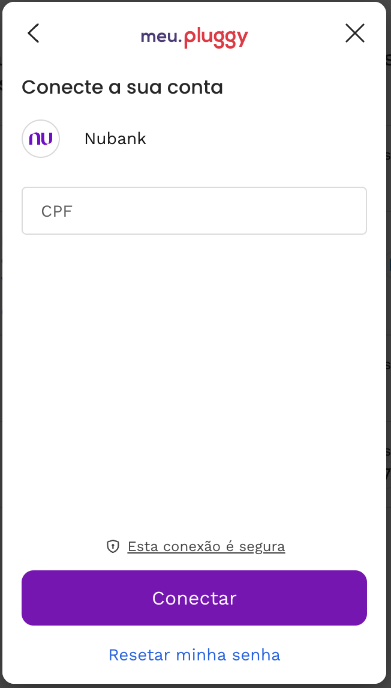

Once connected you will be able to review all the information provided by the institution (checking account, savings account, credit cards, transactions, loans) and will be backup at Pluggy for you to keep track even after account its closed.

The information can be exported to spreadsheets, google sheets, etc. We are actively working with feedback of the community to improve the user experience.

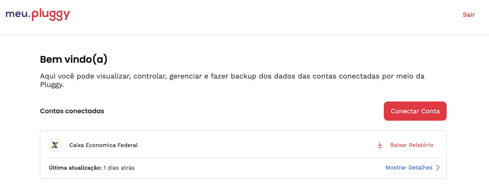

### How to setup your developer access to your data?

Once you have already granted access to your Financial Institution account on [MeuPluggy](https://meu.pluggy.ai), you will be able to access the data through API using our existing documentation and SDKs.

First you will be required to create an account on our [Dashboard (our Developer Portal)](https://dashboard.pluggy.ai), and you will begin a 15 days trial (Don’t worry you will be able to pull information after expires anyway). 

Customize your application to list the *MeuPluggy* connector as one of your desired connectors as shown in the following pictures:

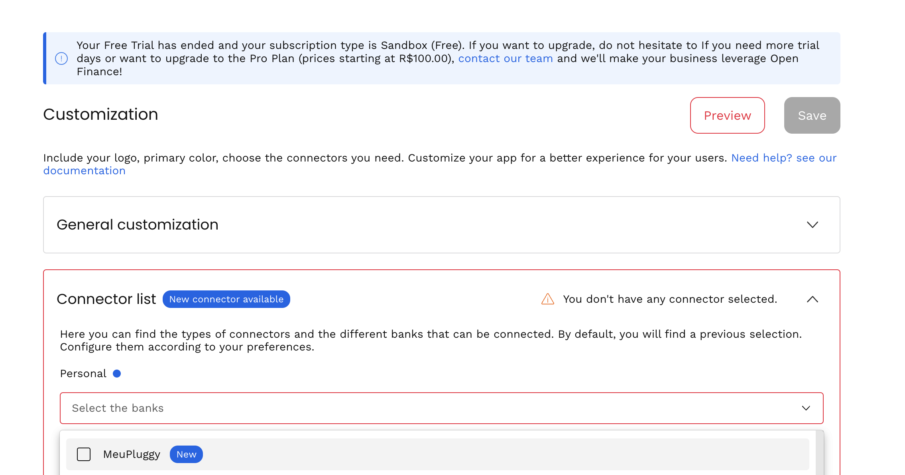

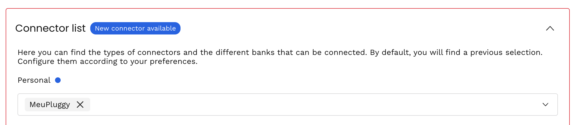

After MeuPluggy is on the Connector List, go to your Application’s page and create a Development Application. This will grant you access to Pluggy API with a development `client_id` & `client_secret`

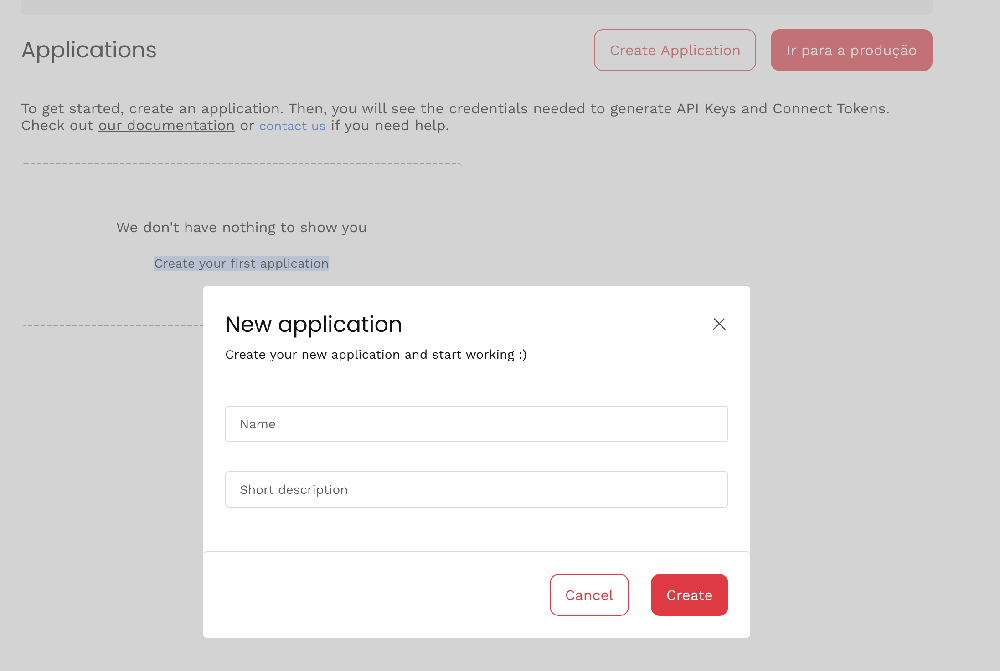 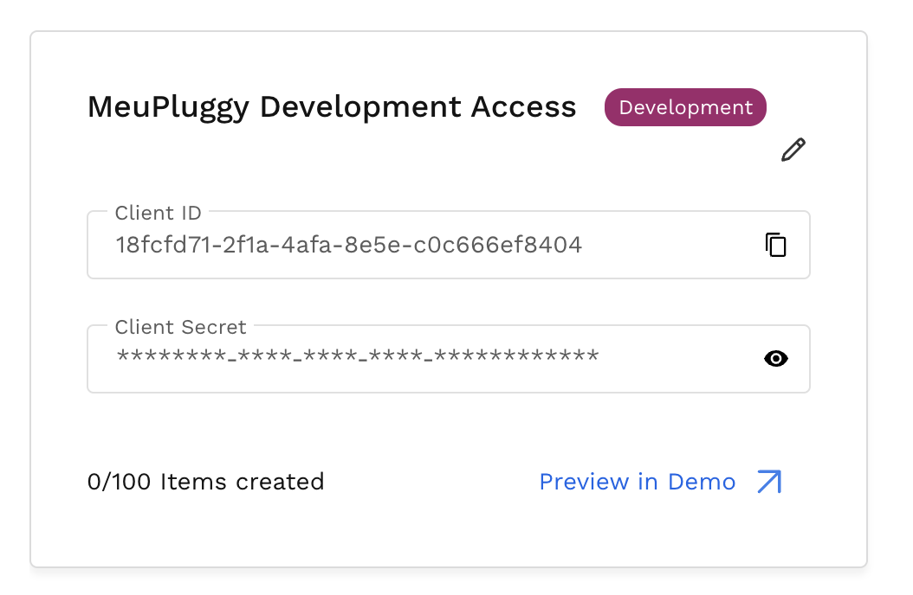

Open the Demo application, to easily link your existing *MeuPluggy* account to your *Pluggy Developer* account, using the MeuPluggy OAuth Authorization.

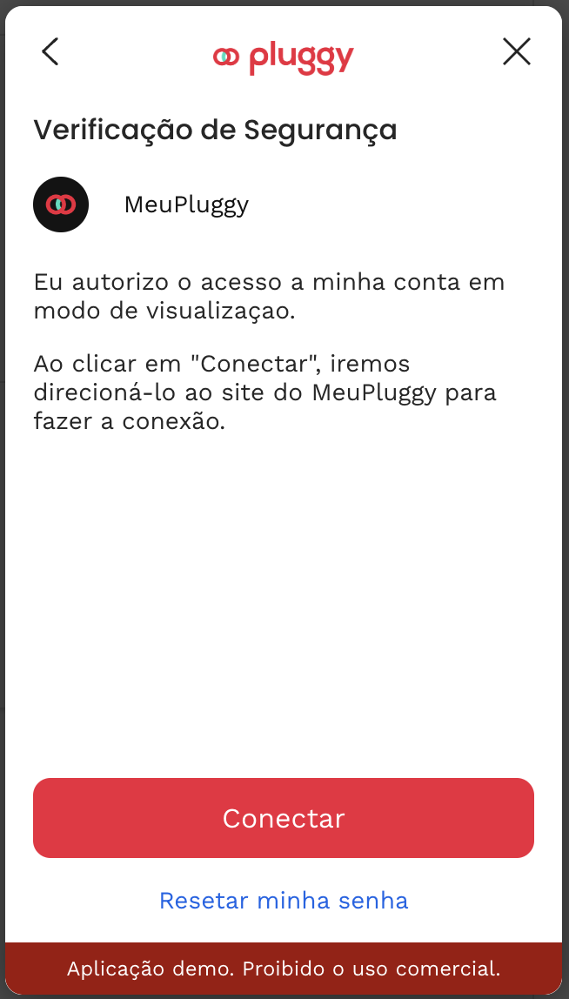 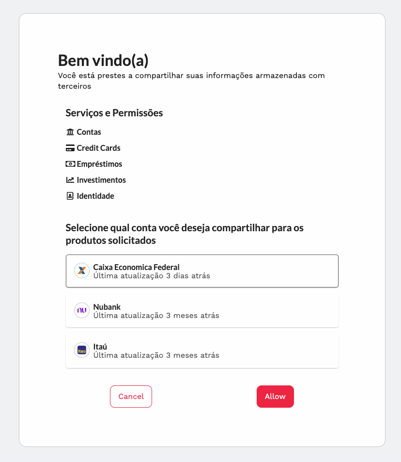

Once the authorization has been granted the connection will be available for you to pull information. This authorization acts like a Proxy to the original connection that its own and maintained by MeuPluggy, and will refresh the information on a daily basis.

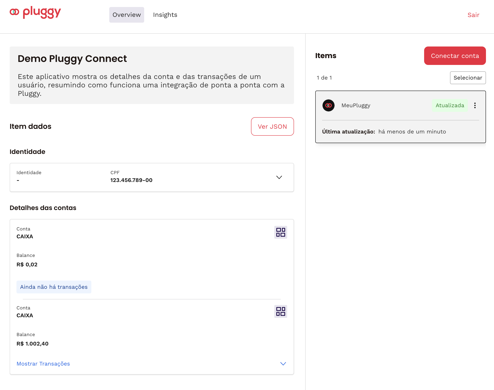

Using the `client_id` and `client_secret` recovered before you will be able to pull your information using our [SDKs, Integrations and more](https://docs.pluggy.ai), and feel free to reach out at our [Discord Server](https://discord.gg/M55jsC8S)